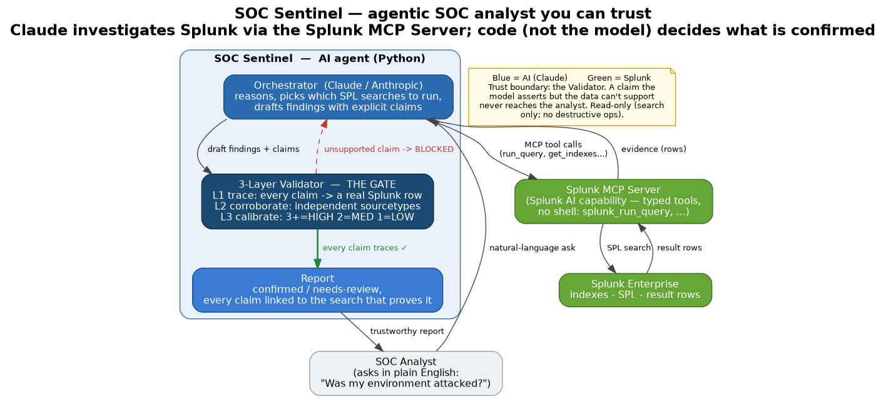
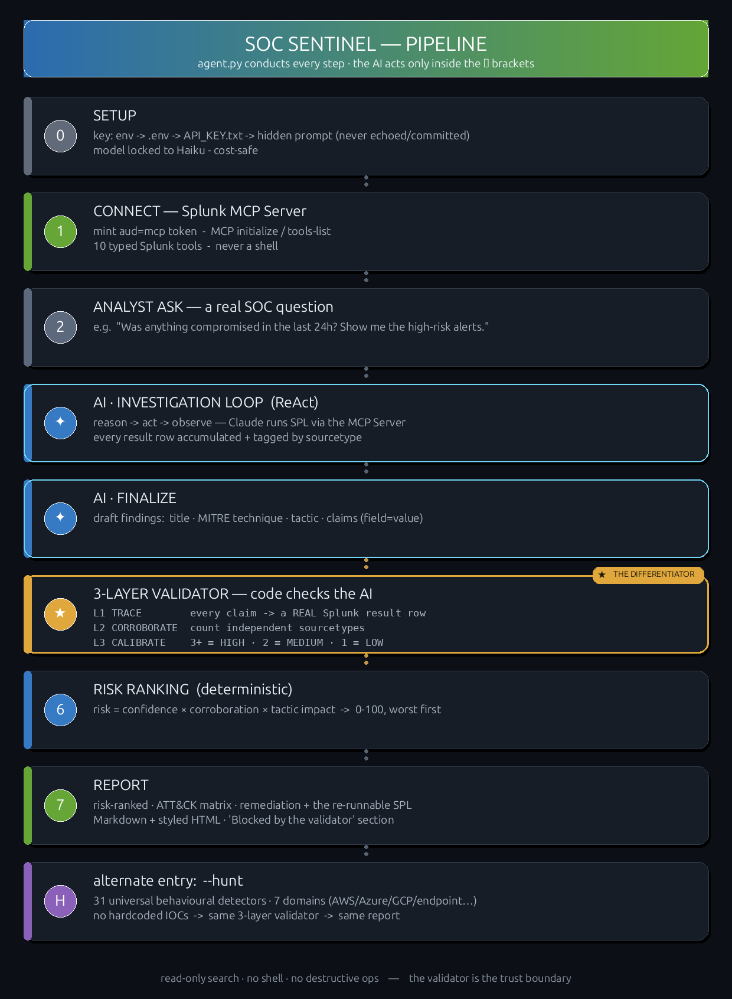
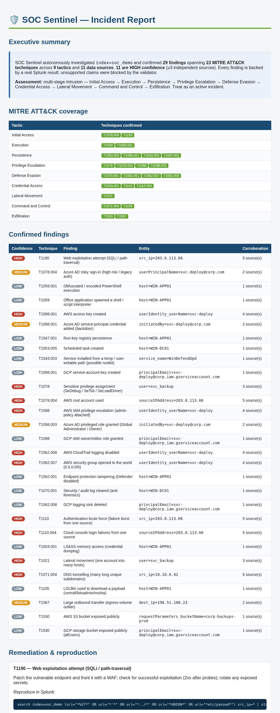

# 🛡️ SOC Sentinel — the hallucination-proof investigation agent for Splunk

**Track: Security** · Splunk Agentic Ops Hackathon 2026 · uses the **Splunk MCP Server** at runtime

> An autonomous SOC analyst that investigates your Splunk data with Claude — but
> where **code, not the model, decides what's "confirmed."** Every finding traces
> back to the exact Splunk search result that proves it; anything the AI can't
> prove is **blocked before it ever reaches the report.**



> 🚀 **New here?** Start with **[Getting Started](docs/GETTING_STARTED.md)** — a plain-English
> explanation of *what the Splunk MCP Server does* and how to connect SOC Sentinel to **your** Splunk.

---

## The problem

Point an LLM at your SIEM and ask *"was I breached?"* and it will happily **invent**
an attacker IP, a hostname, a "confirmed" lateral-movement chain — none of it in your
data. In security that isn't a quirk, it's a dealbreaker: **a confident wrong answer is
more dangerous than no answer** — wasted incident-response hours, wrong escalations,
real threats missed while chasing a fabricated one. It is the single biggest reason
agentic SOC tooling isn't trusted in production.

## What it solves

| Issue with naïve "AI over SIEM" | How SOC Sentinel addresses it |
|---|---|
| **Hallucinated facts** — invented IPs, hosts, "confirmed" breaches | **Layer 1 trace gate** — every claim must match a real Splunk result row or it's blocked. Code decides, not the model. |
| **No provenance** — you can't verify what the AI claims | every confirmed finding links to the exact **SPL + rows** that prove it — re-runnable in seconds |
| **Mis-calibrated confidence** | **Layer 3 calibration** — confidence from *independent-source corroboration* (3+ sourcetypes = HIGH), not the model's gut feel |
| **Unsafe access / prompt injection** | the agent never builds raw queries or shell — only **typed MCP tools, read-only search** |
| **Alert fatigue** | verifiable triage ranked by corroboration, so analysts see what's *real* first |
| **Trust gap blocks adoption** | the report contains nothing unverifiable — safe to hand straight to a SOC |

---

## How it works (the 3-layer trust pipeline)

The anti-hallucination core is ported from a battle-tested DFIR agent and reimplemented
for Splunk. Every candidate finding the AI proposes runs through three deterministic layers:

1. **Layer 1 — Trace gate.** Each claim (`field = value`) must appear in a real Splunk
   result row, or it is `UNSUPPORTED` and blocked. *Code checks the AI.*
2. **Layer 2 — Corroboration.** Count the **independent sourcetypes** that back the
   finding (the Splunk analog of memory + disk + logs cross-checking).
3. **Layer 3 — Calibration.** Evidence-based confidence: **3+ independent sources = HIGH,
   2 = MEDIUM, 1 = LOW.**

Disposition: `confirmed` (all claims trace) · `needs_review` (some) · `rejected` (none) ·
`inconclusive` (no claims). Confidence is only ever assigned to confirmed findings.

See the full step-by-step flow — *the conductor owns every step; the AI acts only inside
the ` AI ✦ ` brackets* — in **[`docs/PIPELINE.md`](docs/PIPELINE.md)**:



## How AI + Splunk are used (at runtime)

- **Reasoning:** **Claude (Anthropic)** drives the investigation loop — forms a hypothesis,
  picks which SPL to run, reads results, proposes findings with explicit claims.
- **Splunk AI capability:** the **Splunk MCP Server** (Splunkbase app 7931, Splunk-supported)
  is the runtime bridge — the agent issues `splunk_run_query` and the other typed MCP tools
  over JSON-RPC at `POST /services/mcp`; it never touches Splunk directly.
- **The guardrail:** the 3-layer validator (`src/finding_validator.py`) gates every finding
  against the real rows.
- **Cost & caching:** the agent uses **Anthropic prompt caching** (the static system prompt +
  tool definitions + a moving conversation-prefix breakpoint each turn are read at 10%) plus
  **tool-result memoization** (identical SPL isn't re-searched) — cutting the dominant token
  cost ~2–4×. A **measured** full Haiku investigation cost **$0.0886 at 76% cache-hit** (≈9 cents); the agent prints the real token usage + `$` per run. The deterministic
  `--hunt` runs all 42 detectors for **$0**. Details: **[`docs/COST.md`](docs/COST.md)**.

See [`architecture_diagram.md`](architecture_diagram.md) for the full data flow.

---

## Quickstart

**Prerequisites:** Splunk Enterprise running locally (mgmt API at `https://localhost:8089`)
with the **Splunk MCP Server** app installed, and Python 3 (the client/validator are
**stdlib-only** — no pip needed; the agent loop calls the Anthropic API over stdlib too).

### 🚀 One command (recommended)
```bash
./soc-sentinel.sh
```
A guided, colorful onboarding: it checks your Splunk + MCP Server, offers to seed the demo,
takes your Anthropic key at a **hidden prompt with live verification** (no key? it falls back
to the free hunt), then runs an investigation and prints the report + the run's $ cost.

### …or the individual steps

```bash
cp .env.example .env          # set SPLUNK_HOST / SPLUNK_USER / SPLUNK_PASSWORD

# 1. prove the MCP integration (lists the 10 tools, runs a real search)
python3 src/splunk_mcp.py

# 2. seed a reproducible breach into Splunk (index=soc_demo) — no BOTS download
python3 src/seed_demo_index.py

# 3. THE DIFFERENTIATOR — 3-layer gate on real security data, no API key needed
python3 src/agent.py --demo

# 3b. universal hunt — run the behavioural detection pack across the kill chain
python3 src/agent.py --hunt

# 4. full agentic loop (Claude drives it) — add a key any of 4 ways, then:
echo 'ANTHROPIC_API_KEY=sk-ant-...' >> .env      # or env var / API_KEY.txt / hidden prompt
python3 src/agent.py "Investigate suspicious authentication and outbound activity in index=soc_demo over the last 24h."
```

### What step 3 prints (live, deterministic, no LLM)

```
✅ CONFIRMED  [MEDIUM]  External 203.0.113.66 ran a brute-force + web attack
     L1 trace gate:    1/1 claims trace to real Splunk rows
     L2 corroboration: 2 independent source(s): access_combined, linux_secure
     L3 calibration:   confidence=MEDIUM  (3+ sources=HIGH, 2=MEDIUM, 1=LOW)

🚫 REJECTED  [NONE]  C2 beacon to 8.8.8.8 (model-invented)
     L1 trace gate:    0/1 claims trace to real Splunk rows
```

The invented beacon can't reach "confirmed" — its `dest_ip` never appears in a Splunk row.
That gate is what stops AI hallucinations reaching the report.

---

## Universal detection library

`src/detections.py` ships **42 behavioural detectors** across **7 domains** and the
full ATT&CK kill chain. Each finds *structure or behaviour* — never a hardcoded
IP/host/hash — so it survives a held-out environment (`tests/test_detections.py`
enforces the no-answer-keys rule). They include **Find-Evil-grade high-value detectors**
ported to log-native Splunk: **memory-injection footprints** (CreateRemoteThread,
**ProcessTampering / hollowing**, reflective DLL load — the Sysmon equivalent of
Volatility `malfind`/`hollowprocess`), credential dumping (SAM/LSASS), recon bursts,
PsExec/RDP lateral movement, WMI event-subscription persistence, system-process
masquerade, anti-forensics (secure-wipe), and ransomware prep. A sample:

| Tactic | Technique | Detector |
|---|---|---|
| Credential Access | T1110 | auth-failure burst from one source |
| Initial Access | T1190 | SQLi / path-traversal in web requests |
| Execution | T1059.001 | encoded / obfuscated PowerShell |
| Execution | T1059 | Office app spawning a shell |
| Persistence | T1543.003 | service launched from a temp / user-writable path |
| Privilege Escalation | T1078 | SeDebug / SeTcb / SeLoadDriver assigned |
| Defense Evasion | T1070.001 | security / audit log cleared |
| Lateral Movement | T1021 | one account into many hosts |
| Command & Control | T1071 | low-jitter periodic beacon |
| Exfiltration | T1567 | egress-volume outlier |
| Exfiltration | T1530 | cloud object store made public |
| Credential Access | T1110.004 | cloud console login failures |

`python3 src/agent.py --hunt` runs the whole pack through the MCP server and
validates each hit; corroboration across independent sourcetypes is what elevates
the real attacker to HIGH and leaves single-source noise at LOW.

See the **[top-5 advanced attacks it finds](docs/CASES.md)** — with a
**[step-by-step walkthrough of #1 on real data](docs/WALKTHROUGH.md)** — and the
**[cost & caching analysis](docs/COST.md)** (prompt caching + tool memoization; the
deterministic `--hunt` runs the same 42 detectors for **$0**, a live agent run is pennies).

## Reporting

Every hunt/investigation produces an analyst-ready **incident report** (Markdown +
styled self-contained HTML) — executive summary, **MITRE ATT&CK coverage matrix**,
a color-coded findings table (confidence + corroboration), and **per-technique
remediation with the exact re-runnable SPL** that proves each finding. Sample:
[`reports/incident_report.html`](reports/incident_report.html).



A real live Claude (Haiku) investigation transcript — 30+ MCP tool calls, findings
gated by the validator — is saved at
[`artifacts/sample_investigation.txt`](artifacts/sample_investigation.txt).

## Layout

| File | Purpose |
|---|---|
| `src/splunk_mcp.py` | Splunk MCP Server client — token mint + JSON-RPC (`initialize`/`tools/list`/`tools/call`) |
| `src/agent.py` | the agentic loop (Claude over MCP) + the deterministic gate demo |
| `src/finding_validator.py` | the 3-layer trust pipeline — **the differentiator** |
| `src/seed_demo_index.py` | reproducible SOC dataset (a full intrusion to hunt) |
| `src/api_key.py` | "can't-get-stuck" key entry: env → .env → `API_KEY.txt` → hidden prompt |
| `tests/test_validator.py` | unit tests for the 3 layers |
| `docs/architecture.png` | the architecture diagram (above) |

## Compliance (anti-disqualification)

- ✅ **Splunk AI used at runtime** — the agent calls the Splunk MCP Server live (not mocked / not planned)
- ✅ **Architecture diagram** — `docs/architecture.png`
- ✅ **New project** — all commits during the hackathon period
- ✅ **OSI license** — MIT ([LICENSE](LICENSE))
- ✅ **Public repo** — see About

## License
MIT — see [LICENSE](LICENSE).
