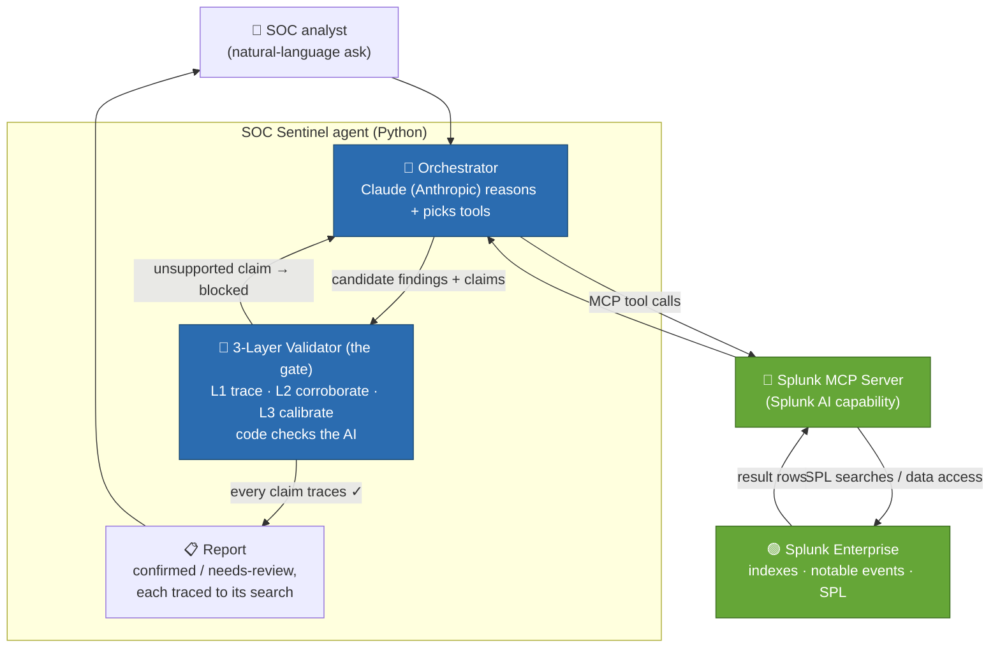

# SOC Sentinel - Architecture

**Track:** Security · **Splunk AI capability used:** Splunk MCP Server (agent ↔ Splunk data) + the agent's deterministic validator.

> The thesis: AI agents over SIEM data **confidently hallucinate**. SOC Sentinel makes that impossible to ship - **code, not the model, decides what's confirmed**, and every finding traces to a specific Splunk search result.

*(Rendered image above - source: [`docs/architecture.dot`](docs/architecture.dot). The Mermaid below renders the same flow inline on GitHub.)*

## How it interacts with Splunk
The agent never touches Splunk directly - it goes through the **Splunk MCP Server**, which exposes Splunk search/data as typed tools. The agent issues SPL searches via MCP and receives result rows.

## How AI is integrated
- **Reasoning:** Claude (Anthropic) drives the investigation loop - forms a hypothesis, picks which SPL searches to run via the MCP Server, reads the results, and proposes findings.
- **Splunk AI capability:** the **Splunk MCP Server** is the runtime bridge between the AI agent and Splunk data (the hackathon's "connect AI agents to Splunk data" capability).

## Data flow (services → APIs → components)
1. Analyst asks a question →
2. Orchestrator (Claude) plans + calls the **Splunk MCP Server** →
3. MCP Server runs **SPL** against **Splunk Enterprise** → returns rows →
4. Orchestrator drafts findings with explicit **claims** (field = value) →
5. **3-Layer Validator** checks every claim against the returned rows (L1 trace → L2 corroboration → L3 calibration) - unsupported → blocked back to the agent; fully-traced → confirmed with a HIGH/MEDIUM/LOW confidence →
6. **Report** to the analyst: each finding linked to the exact search that proves it.

## Trust boundary
Splunk data is read via search only (no destructive ops). The **validator is the gate**: a finding the model asserts but the data doesn't support **cannot reach the report as "confirmed."**
