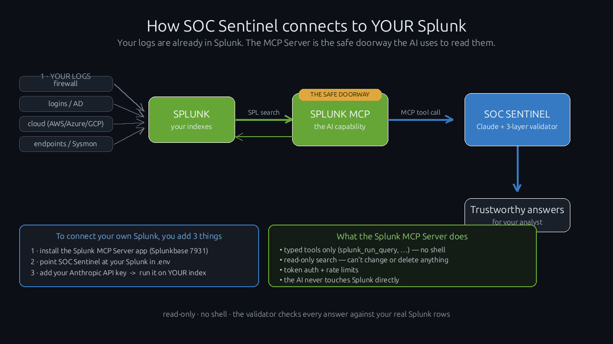

# Getting Started — connect SOC Sentinel to your Splunk

*For a newcomer. No deep Splunk or AI knowledge needed.*

---

## "I already have my logs in Splunk — what is the Splunk MCP Server's role?"

Your logs (firewall, logins, cloud, endpoints) are already flowing into Splunk —
that's your **haystack**. You want an AI to investigate it and answer *"was I
attacked?"* — but you must **not** give an AI a shell or let it run whatever it wants
on your Splunk.

The **Splunk MCP Server is the safe doorway** between the AI and your Splunk. The
easiest way to picture it:

> **Splunk = a huge library** (all your logs).
> **SOC Sentinel's AI = a researcher** who wants answers.
> **The MCP Server = the librarian at the desk.** The AI hands the librarian a
> *request slip* (an SPL search). The librarian runs only that, fetches the matching
> rows, and hands them back. The AI **never walks into the stacks, never touches the
> catalog, never gets a shell.**

So the MCP Server gives you:

- **Typed tools only** — `splunk_run_query`, `splunk_get_indexes`, `splunk_get_metadata`, … (no arbitrary commands)
- **Read-only search** — it can't change, delete, or break anything
- **Token authentication + rate limits**
- **The AI never touches Splunk directly**

It's the official, **Splunk-supported** way to connect an AI agent to Splunk
(Splunkbase app **7931**). SOC Sentinel adds the *brain* (Claude investigates) and the
*trust layer* (a deterministic validator checks every answer against your real rows).



---

## The flow, in one line

```
your logs ─▶ Splunk (your indexes) ─▶ Splunk MCP Server ─▶ SOC Sentinel ─▶ answers
                                       (the safe doorway)    (Claude + validator)   you can trust
```

```mermaid
flowchart LR
    L["Your logs<br/>firewall · logins · cloud · endpoints"] --> S["🟢 Splunk<br/>your indexes"]
    S -- "SPL search" --> M["🔌 Splunk MCP Server<br/>typed tools · read-only · token auth"]
    M -- "result rows" --> S
    A["🧠 SOC Sentinel<br/>Claude + 3-layer validator"] -- "MCP tool call" --> M
    A --> R["📋 Trustworthy answers<br/>every claim traced to a real Splunk row"]
    classDef g fill:#65A637,color:#fff; classDef b fill:#2b6cb0,color:#fff;
    class S,M g; class A b
```

---

## Connect your own Splunk — 3 steps

You only add three things. (Full setup detail is in [`SIFT-SENTINEL-SETUP-GUIDE`](../README.md) /
the [README](../README.md) quickstart; this is the short version.)

### 1 · Install the Splunk MCP Server app
- Download **"Splunk MCP Server"** from Splunkbase (app **7931**).
- Install it into your Splunk and restart:
  ```bash
  sudo /opt/splunk/bin/splunk install app /path/to/splunk-mcp-server_*.tgz -auth admin:'<password>'
  sudo /opt/splunk/bin/splunk restart
  ```
- Your `admin` role automatically gets the `mcp_tool_execute` + `mcp_tool_admin`
  capabilities. (Token authentication must be enabled, and the KV Store must be up —
  both are on by default.)

### 2 · Point SOC Sentinel at your Splunk
```bash
git clone https://github.com/3sk1nt4n/SOC-Sentinel-Splunk.git
cd SOC-Sentinel-Splunk
cp .env.example .env
```
Edit `.env` with **your** Splunk:
```
SPLUNK_HOST=https://YOUR-SPLUNK-HOST:8089
SPLUNK_USER=admin
SPLUNK_PASSWORD=YOUR-PASSWORD
```
SOC Sentinel mints the `aud=mcp` token for you and talks to the MCP Server at
`POST {SPLUNK_HOST}/services/mcp` — nothing else to configure.

### 3 · Add your Anthropic key, then run it on YOUR index
Put your key in `API_KEY.txt` (gitignored), or `export ANTHROPIC_API_KEY=sk-ant-…`, then:
```bash
# prove the connection (lists the MCP tools, runs a real search)
python3 src/splunk_mcp.py

# investigate YOUR data — just name your index in the question
python3 src/agent.py "Was anything compromised in index=YOUR_INDEX in the last 24h? Show the high-risk alerts."

# or the deterministic detector hunt (no API key needed)
python3 src/agent.py --hunt YOUR_INDEX
```
You'll get a risk-ranked report (`reports/incident_report.html`) where **every
finding traces back to a real Splunk search** you can re-run yourself.

> **Just trying it out?** Skip step 2's index — `python3 src/seed_demo_index.py --reset`
> loads a self-contained demo breach into `index=soc_demo` so you can see the whole
> thing work in two minutes.

---

## FAQ (junior level)

**Do I need to move or copy my logs?** No. SOC Sentinel reads them where they already
live in Splunk, through the MCP Server. Nothing is exported.

**Can the AI break or change my Splunk?** No. The MCP Server is **read-only search**
only — no writes, no deletes, no shell.

**Why not just let the AI run searches itself?** Because then you'd be trusting the AI
with credentials and free rein. The MCP Server is a narrow, typed, audited doorway —
and SOC Sentinel's validator double-checks every answer against your real rows, so a
made-up finding can't reach your report.

**Which logs work best?** Anything security-relevant: authentication, firewall/network,
cloud audit (AWS/Azure/GCP), and endpoint/Sysmon. The 40+ detectors cover all of these.

**Does it cost money?** The MCP Server + Splunk are yours. SOC Sentinel's agent calls
Claude (Anthropic) — a single investigation is typically cents on the Haiku model.
